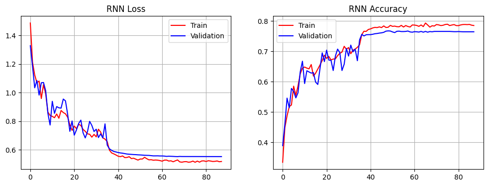
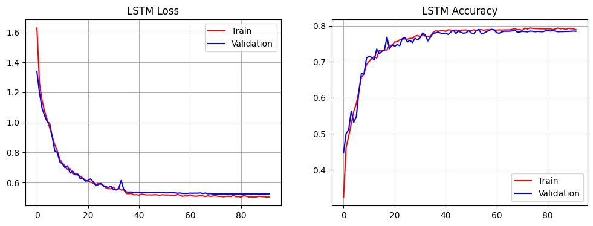
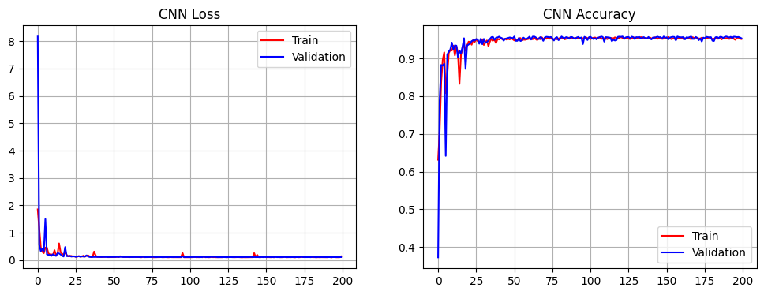
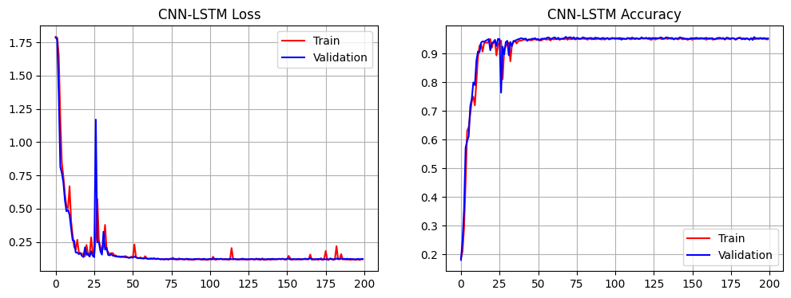

# Human Activity Recognition

in this project I have trained several Networks on HAR dataset and compared them to see which network has better accuracy.

the notworks I have used are `1 dimensional CNN`, `RNN`, `LSTM` and combination of `1 dimensional CNN` and `LSTM`.

## RNN
we can use the output of `RNN` for this task using two architecture:

### Many to One
in this type of output, we can use only the output of last time step. the plots for loss function and accuracy are as following:

as you can see the final accuracy is about 0.79 on validation. it should be mentioned that I have used 4 layers of `RNN` at this stage.

the weakness of the approach is that our network is not able to use the outputs of previous time steps. this means that we loose some of our information and we can not use all potential of our network.
to address the above issue, we can use the `Many to Many` architecture. 

### Many to Many

in this type of output, we have access to the all of previous outputs. by calculating mean of them and using a classifier layer, we can achieve better results:

.png)

and as you can see here we have achieved the accuracy of 0.93.
in the next step I will compare the operation of a `LSTM` network with one layer to the operation of `RNN` with 4 layers.

## LSTM
`LSTM` networks are able to use the outputs of previous hidden cells more than `RNN`. which allows them to process signals with a better accuracy.
Since `LSTM`s have more trainable parameters more than `RNN`s (about 4 times), I have used only one layer of `LSTM`. 

just like before, I have used `Many to One` and `Many to Many` outputs:

### Many to One
the results for the Many to One output is as below:

comparing to the results of `Many to One` output for `RNN`, we can see the result of obviously better.

### Many to Many

in order to use the all potential of `LSTM` we have used all of its outputs and the results are as below:

.png)

## CNN

Before Recurrent Neural Networks, `CNN`s were used for signal processing tasks. here I have used CNN to see its results:

you can see by using CNN we can achieve better results than RNN, however CNN can not be a good choice for bigger datasets, this is because in bigger dataset we have to use the information of previous time steps. For example, language modeling tasks can not be done by using CNNs.

## CNN-LSTM

in this part I have used the combination of CNN and LSTM. Convolutional Neural Networks are great feature extractor. we can use their potential to achieve greater accuracy.

and you can see that by using combination of CNN and LSTM, the results are remarkable.

# Final results

In the part, I have gathered all of accuracies and losses:

|Network|Output Type|Loss|Accuracy|
|------|-----|-----|----|
|RNN |Many to One|0.55|0.76|
|RNN |Many to Many|0.17|0.93|
|LSTM |Many to One|0.52|0.78
|LSTM |Many yo Many|0.22|0.92|
|CNN| - |0.106|0.95
|`CNN-LSTM`|-|`0.11`|`0.95`
